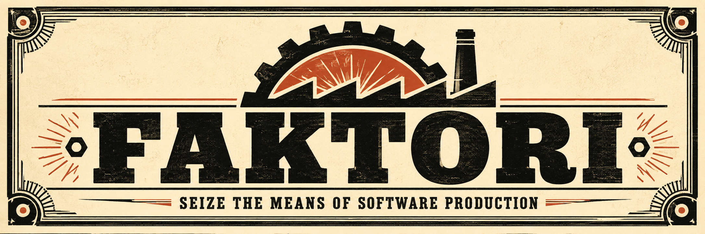
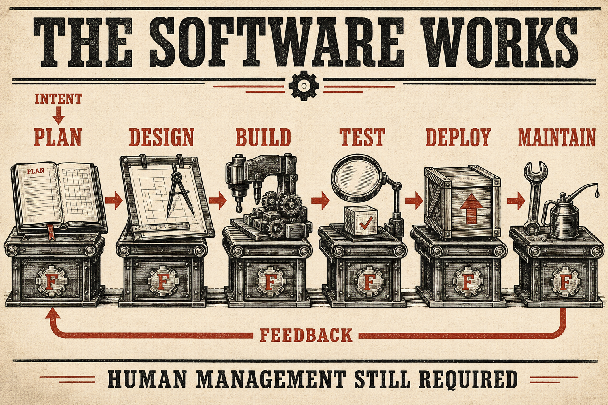
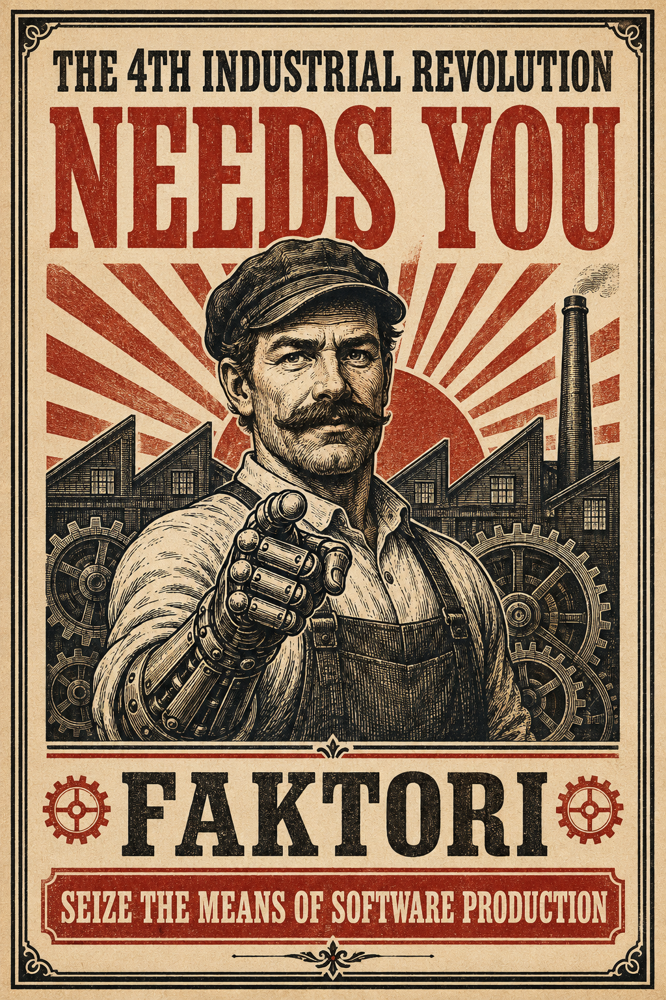

<div align="center">



### Seize the means of software production.

The Fourth Industrial Revolution has reached your backlog.<br>
Self-hosted. Open source. Human management still required.

[Agent installation guide](INSTALL.md) · [Explore the skills](docs/skills.md) · [Architecture](docs/architecture/README.md) · [Status](#where-we-are)

</div>

---

## Congratulations, you own a factory now.

The first industrial revolution mechanized labor. The second gave it a production
line. The third put a computer on everyone's desk. The fourth has three computers
asking each other whether the tests actually passed.

Progress.

Coding agents can write software. Unfortunately, someone still has to explain
what to build, coordinate the work, review the result, and establish whether
“deployment successful” means anything is working.

**Faktori gives those agents a shared operating system for delivery.** Think
factory floor, not another chat window with a hard hat on its logo.
Intent, specifications, policies, and evidence stay yours—not trapped in one
provider's conversation history. Codex, Claude Code, and Cursor work against
the same source of truth, with explicit scope and portable handoffs.

Start with one developer, one product, and one provider. Add products, pods,
or specialists when the work calls for them. A to-do app does not require a
Ministry of Agent Coordination.



*Conceptual lifecycle, not a Console screenshot.* Intent and configuration guide
the work; shared artifacts, explicit authority, and evidence connect the stages.
Testing also happens throughout implementation, not just at one inspection station.

## Your new means of production

| Capability | What it gives you |
| --- | --- |
| **Agent-guided setup** | Discover resources, clarify intent, approve a configuration, and provision with interruption recovery. The machinery interviews you before ordering more machinery. |
| **16 bundled skills** | Interview, research, plan, design, build, test, review, deploy, maintain, update, and hand off. An employee handbook the employees might actually read. |
| **Three provider adapters** | Codex, Claude Code, and Cursor. Use one or combine them. Supplier loyalty is not an architectural requirement. |
| **A local Console** | Work board, hierarchy, run timelines, decisions, resource visibility, and health. See the factory floor without opening seventeen tabs. |
| **Recoverable coordination** | Durable records, bounded admission, workspaces, cancellation, and reconciliation. “We lost the clipboard” is not a recovery strategy. |
| **Owner-controlled delivery** | GitHub, optional Jira, revision-bound evidence, and configurable release authority. A robot saying “looks good” is not automatically a shipping permit. |
| **An AI Factory GM** | Diagnose factory problems and propose improvements. Keeps the lights on; cannot promote itself to chairman. |

### Industrial capacity. Cottage-industry overhead.

- **The revolution has a budget.** Configure spending, concurrency, providers,
  and human attention. Missing cost telemetry stays unknown; subscriptions are
  not treated as unlimited inference budgets.
- **Bring your own machinery.** The lifecycle is stack-neutral. Product commands
  and contracts belong with the product, not in a universal framework.
- **No five-year plan for a one-line fix.** A small bug gets a compact record.
  A consequential change gets deeper design and verification.
- **Management retains the keys.** Defaults favor human approval at consequential boundaries.
  Owners can change policies after acknowledging the specific risks.
- **Own the factory, not a lease on the lobby.** No required Faktori account, hosted control plane,
  marketplace, or billing service. Provider and integration access remain yours.

## Start with an intent

Every industrial empire begins with a modest request that will eventually
require a database migration. Yours begins here.

Clone the repo and open it in your coding agent:

```sh
git clone https://github.com/PARAD111GM/faktori.git
cd faktori
```

Then ask:

> Read INSTALL.md and follow its agent installation instructions. Use Faktori to build me a
> software factory for **[my product]**. Discover my existing resources, interview
> me about what matters, and propose the simplest suitable setup before provisioning.

The agent should work from your resources, budget, and authority—not assume
you want three providers, a new pod, or another paid service. Logins stay in
the providers' own flows. Unavailable capabilities and blocked steps must be
reported rather than silently substituted.

**This is an early development kit, not a one-click production release.**
Start with a disposable product and approved test resources. Read
[onboarding](docs/onboarding/interview.md), [provisioning](docs/provisioning/README.md),
and the [compatibility matrix](docs/maintenance/compatibility.md) before connecting
important work.

### Inspect the machinery

Use **Node.js 24 LTS and npm 12**. Native SQLite support may require platform
build tools. From the source checkout:

```sh
npm ci --ignore-scripts
npm rebuild better-sqlite3
npm run build
npm run skills:verify
npm run typecheck
npm test -- --maxWorkers=4
npm run pack:verify
```

The packed check exercises a clean installed CLI, including SQLite behavior
and the shipped skill kit. It does not prove live provider authentication.
For a small read-only configuration example:

```sh
npm run faktori -- config resolve examples/config/solo.json
npm run faktori -- run manifest examples/runtime/interrupted-run.jsonl example-run
npm run faktori -- preflight examples/diagnostics/preflight-projection.json
```

An approved factory can import a named local product during initial
provisioning, and `faktori product new` adds one separately discovered and
approved product later without creating an implicit pod. `faktori console
prepare` creates the local Console configuration from an approved projection
request; `faktori preflight` checks configuration, projection, execution,
provider, integration, resource, and live-evidence readiness without launching
work. Follow the [provisioning](docs/provisioning/README.md), [local Console](docs/console.md),
and [operational clarity](docs/operational-clarity.md) guides for the request
contracts and authority boundaries.

The current Console supports native Codex, Claude, and Cursor routes and an
isolated Codex route; it does not promise identical sandboxing or interaction
across all three.

## The paperwork is load-bearing

**Documents define the work. Providers hold their own records. The coordinator
records execution. The Console makes it visible.**

This is the unfashionable part of the revolution: writing things down so the
next shift does not reinvent the company.

Accepted intent, plans, policies, and configuration live in version control.
Issues, PRs, CI results, and deployments remain authoritative in their configured
systems. A local operational journal supports restart recovery; SQLite provides
rebuildable views.

The runtime is one Node.js/TypeScript application with Fastify, React/Vite,
SQLite, and agent workers. There is no cluster to operate just to get started.
Generated factory configuration belongs in a separate owner-controlled
repository; product artifacts normally live beside product code.

## Where we are

**Early development. Useful foundations; release validation still in progress.**

The ribbon-cutting committee has been asked to wait for evidence.

`main` includes accepted Phases 0–6, the complete 16-skill SDLC kit, the Phase 7
runtime and validation work, and manager-accepted Phase 8 operational clarity.
Phase 8 provides structured blockers, redacted run manifests, and fail-closed
read-only preflight/remediation through the public CLI and Console.

Phase 7 is deliberately not represented as fully accepted. F7-01 cold-start
validation and F7-02 isolated Linux Node/Python delivery were accepted. F7-03,
the Twinzy proof, is owner-deferred and did not pass. The paired comparison
evidence is complete, but F7-04 release acceptance remains blocked by that unmet
dependency; its three-case result is one bounded case study with
non-commensurate usage schemas, not a generalized performance win or a V1
release claim.

- [Phase 7 evidence](docs/build/phase-7-report.md) records the exact accepted,
  deferred, and blocked boundaries.
- [Phase 8 operations](docs/operational-clarity.md) documents the integrated
  diagnostic commands and their fail-closed evidence model.
- Windows through WSL2 remains unverified. Consult the compatibility matrix
  for observed host and provider coverage.

Longer term: migration assistance, extension tooling, remote workers, and richer
collaboration. They are directions—not shipped features or prerequisites.

## Manuals for the newly industrialized

| Start here | When you need it |
| --- | --- |
| [Skill kit and routing](docs/skills.md) | Choose the right playbook without loading everything. |
| [Product intent](docs/intent.md) | Understand scope and design principles. |
| [Configuration](docs/configuration/README.md) | Products, pods, providers, budgets, and overrides. |
| [Templates](templates/README.md) | Copy and run a ready-made workflow, starting with the Manager Loop. |
| [Manager Loop proof of concept](docs/manager-loop.md) | Run phased Codex implementation, independent review, and bounded repairs in a disposable project. |
| [Lifecycle and artifacts](docs/lifecycle/contract.md) | Trace intent through evidence and release. |
| [Hierarchy and context](docs/context/README.md) | Give agents relevant scope without unrelated baggage. |
| [Providers](docs/providers/README.md) | Understand adapter contracts and capability boundaries. |
| [Runtime](docs/runtime/README.md) | Explore execution, cancellation, publication, and recovery. |
| [Operational clarity](docs/operational-clarity.md) | Inspect blockers, run manifests, and fail-closed preflight results. |
| [Maintenance](docs/maintenance/README.md) | Back up, restore, reconcile, and update. |
| [Implementation plan](docs/implementation-plan.md) | Read the full V1 commitment and acceptance criteria. |
| [Skill verification report](docs/build/sdlc-skills-report.md) | See what was checked and what remains unproved. |

## Join the works

Bring a real workflow, a reproducible problem, or a smaller way to solve one.
Read [AGENTS.md](AGENTS.md) before changing code. Keep contributions bounded,
preserve owner authority, and include behavior-level evidence.

Grand declarations about the future of labor are welcome after the tests pass.

Faktori is licensed under [Apache 2.0](LICENSE). Adapted third-party guidance is
credited in [the notices](docs/third-party-notices.md).

---

<div align="center">

**The means of production are now a Git repository. Please review before merging.**

</div>

<p align="center">
  
</p>
